# 如何获取相机权限，并完成二维码扫描

## 使用的开源库

[react-native-smart-barcode](https://link.jianshu.com/?t=https://github.com/react-native-component/react-native-smart-barcode)

[react-native-smart-timer-enhance](https://github.com/react-native-component/react-native-smart-timer-enhance)

安装

```shell
    npm install react-native-smart-barcode --save
    npm install react-native-smart-timer-enhance --save
```

## Ios 配置

### 1. 添加 RCTBarCode.xcodeproj 到项目中

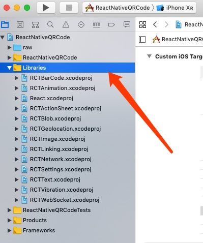

右键点击 Libraries 选择 Add file to "your project name"

将  \node_modules\react-native-smart-barcode\ios\RCTBarcode\RCTBarCode.xcodeproj 添加到Xcode项目中。

### 2. 添加依赖

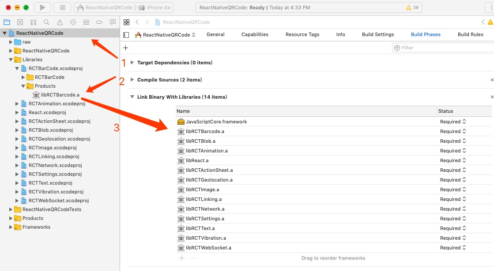

1. 双击项目

2. 找到 Libraries -> RCTBarCode.xcodeproj -> Products -> libRCTBarcode.a

3. 将 libRCTBarcode.a 拖拽到 Build Phases -> Link Binary With Libraries

### 3. 设置 Header Search Paths

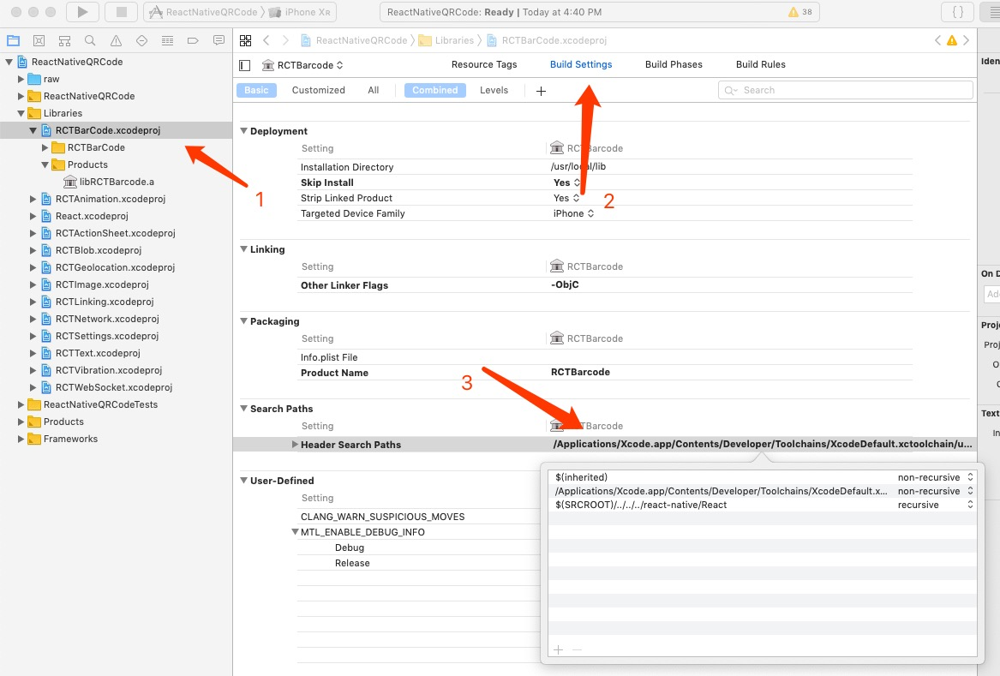

1. 双击 RCTBarCode.xcodeproj

2. 选择 Build Settings 选项

3. 找到 Search Paths -> 双击查看是否有 $(SRCROOT)/../../../react-native/React  如果没有将 $(SRCROOT)/../../../react-native/React 添加进去并选择 recursive  （如图步骤3所示, 如果设置过则不需要重复设置

### 5. 添加 Raw 文件夹

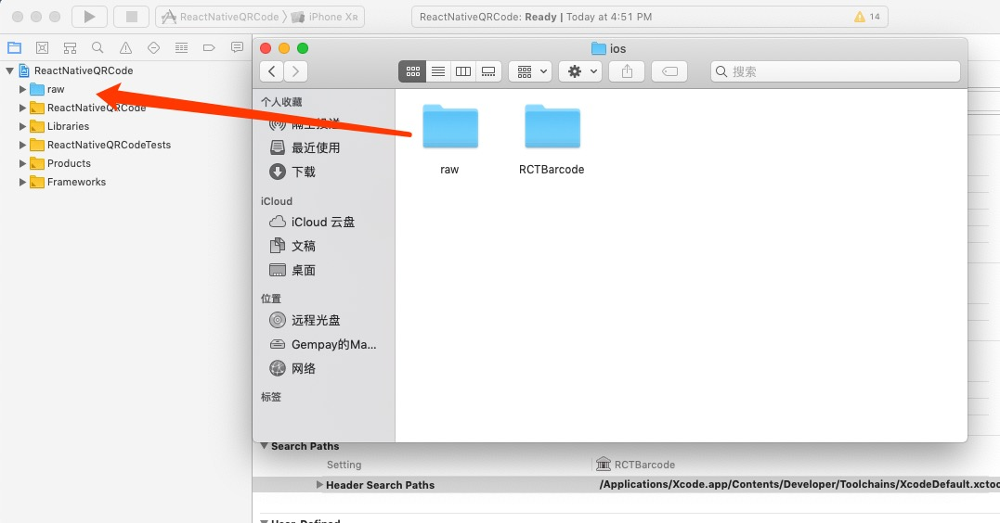

1. 将 node_modules\react-native-smart-barcode\ios\raw  拖拽到 项目中 （如图所示）

### 6. 添加 相机使用权限

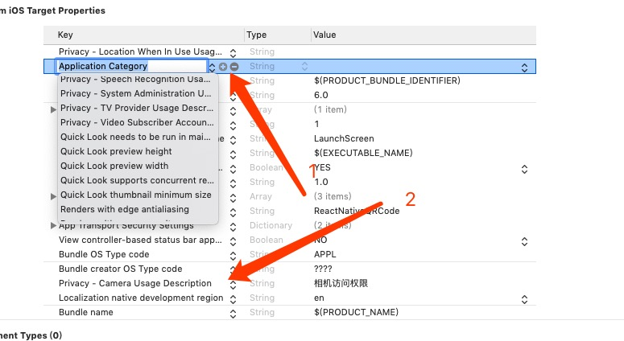

1. 点击加号选取 Privacy - camera Usage Description  (请按照提示选取，最好不要手动输入)

2. 选取后即可在列表中看到增加的相机使用权限

## Android 设置

Android的配置较为复杂，需要你对代码进行修改，如果修改后发现无法运行，请按照文档仔细阅读，查看是否遗漏了某一步骤。


### 1. 修改 settings.gradle 文件

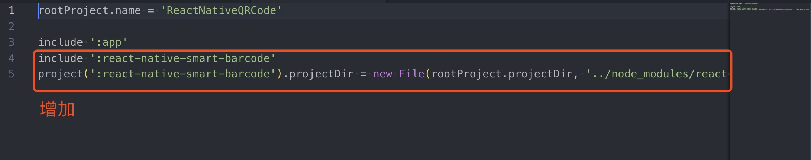

```java
...
include ':react-native-smart-barcode'
project(':react-native-smart-barcode').projectDir = new File(rootProject.projectDir, '../node_modules/react-native-smart-barcode/android')
```

### 2. 修改 build.gradle 文件

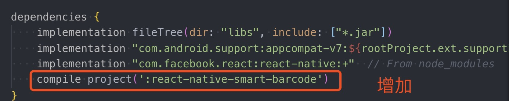

修改 你的项目/android/app/build.gradle 文件，增加以下语句，位置如图所示

```java
compile project(':react-native-smart-barcode')
```

### 3. 修改 MainApplication.java 文件

修改 你的项目/android/app/src/main/com/你的项目名称/MainApplication.java

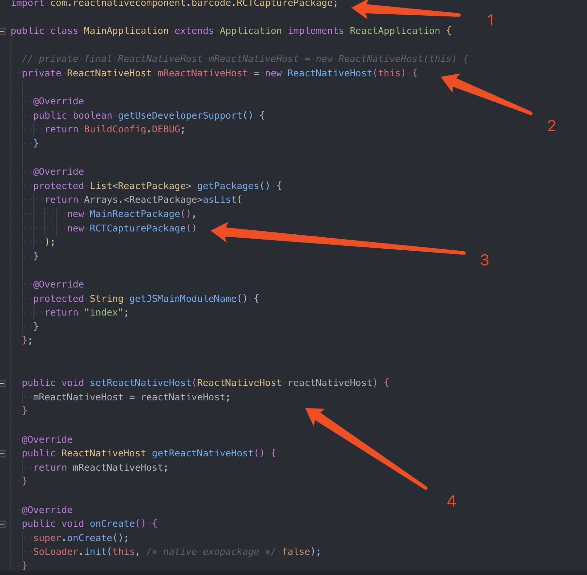

1. 增加 

```java
import com.reactnativecomponent.barcode.RCTCapturePackage;
```

2. 注释愿语句 增加

```java
private ReactNativeHost mReactNativeHost = new ReactNativeHost(this) {
```

3. 增加
注意这里使用,作为间隔
```java
new RCTCapturePackage()
```

4. 增加

```java
public void setReactNativeHost(ReactNativeHost reactNativeHost) {
    mReactNativeHost = reactNativeHost;
  }
```

### 4. 增加相机权限

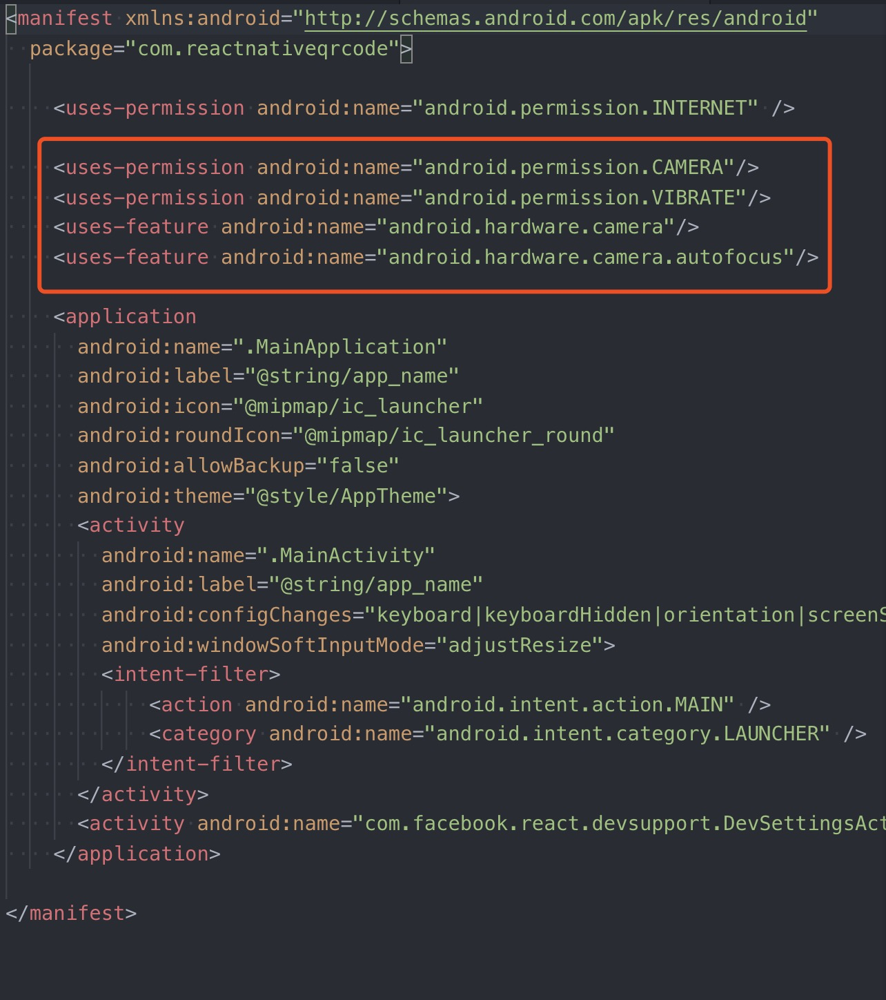

编辑  你的项目/android/app/src/AndroidManifest.xml 文件

增加 

```xml
<uses-permission android:name="android.permission.CAMERA"/>
<uses-permission android:name="android.permission.VIBRATE"/>
<uses-feature android:name="android.hardware.camera"/>
<uses-feature android:name="android.hardware.camera.autofocus"/>
```

### 5. 更改 propTypes

因为新版的 ReactNative 去除了 propTypes 所以我们需要手动安装引入 prop-types 库

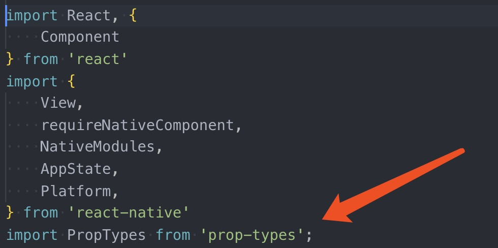
如果你本地没有 prop-types 库 那么你可以手动安装它 

```shall
npm install prop-types --save
```

或者

```shall
yarn add prop-types 
```
首先找到 Barcode.js 文件 目录位置 node_modules/react-native-smart-barcode/Barcode.js
按照图片所示修改文件保存即可。


## 运行结果

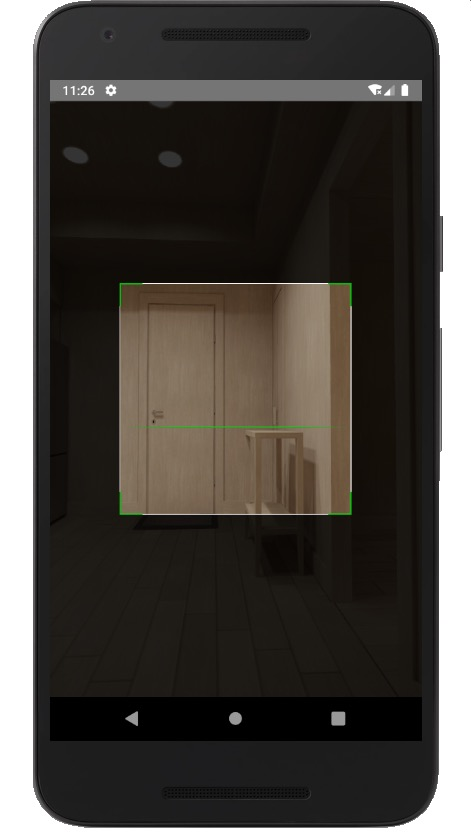

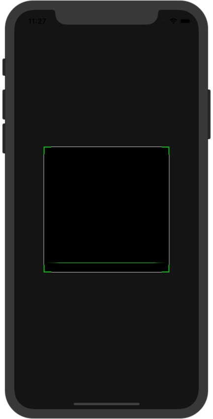

当你在模拟器看到如图所示的界面，那么恭喜你，你已经成功完成这一功能，ReactNative代码可以通过 index.js 查看

```
注：Ios黑屏为正常情况，真机模拟可以查看，Android黑屏极大可能是因为未授权软件相机权限，可以到设置中设计权限即可。
```

## 更换 App 图标

### Android
Android 可以在 你的项目/android/src/main/res 下 替换 mipmap-xxxx 文件中的图即可，尺寸为 （48x48,72x72,96x96,144x144,192*192）

### Ios

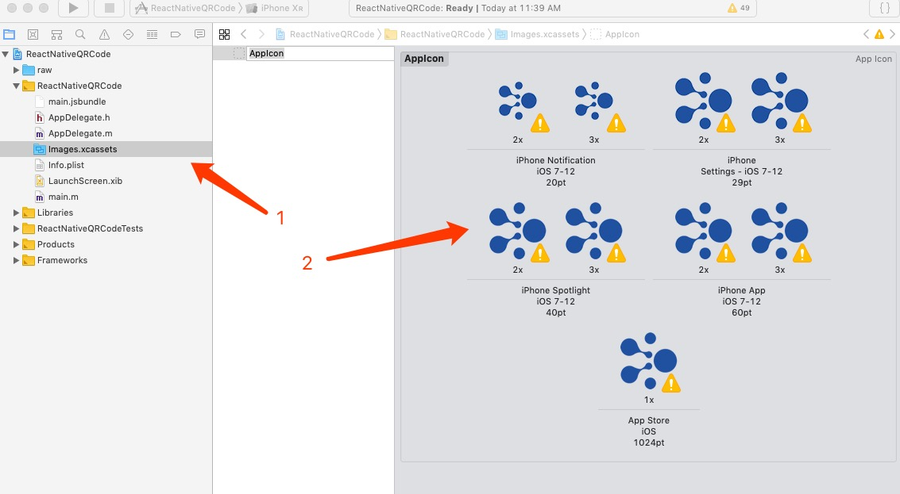

Ios 可以在 Xcode中 找到 images.xcassets 然后将图标拖拽到不同的位置即可。（注意尺寸要与Xcode提供的尺寸大小相符）


## 常见问题

### 1. @Override

遇到 @Override 报错， 找到报错位置 删除 @Override即可

### 2. node-xxxx  xxxxx link

找到 node_modules 下的该目录，删除该目录即可。

### 3. Proptypes error

报错包含 proptypes 一般都是因为 新版本的react-native 去除了 Proptypes 而 react-native-smart-barcode 没有进行更新，按照Android第五步操作即可。

如果遇到其他问题，欢迎给我留言。
